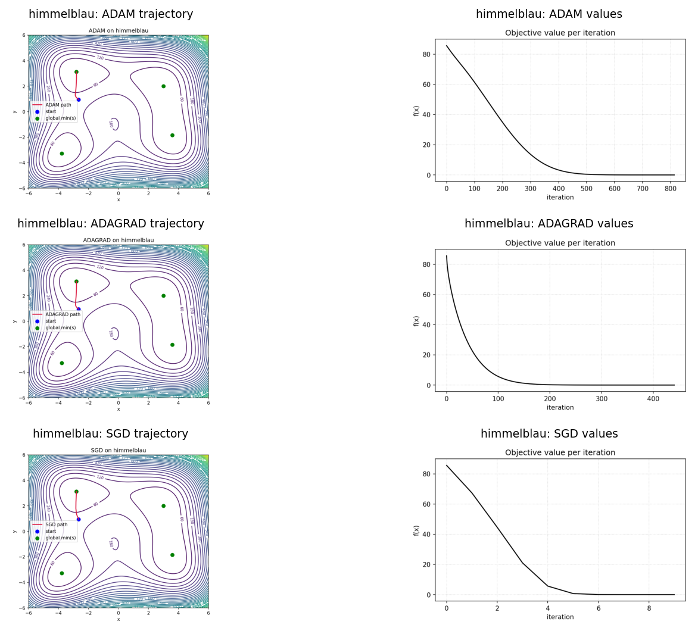
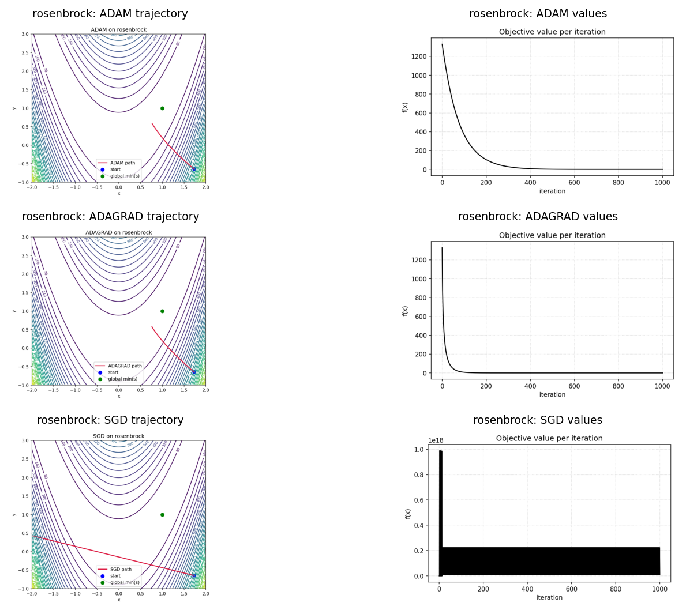
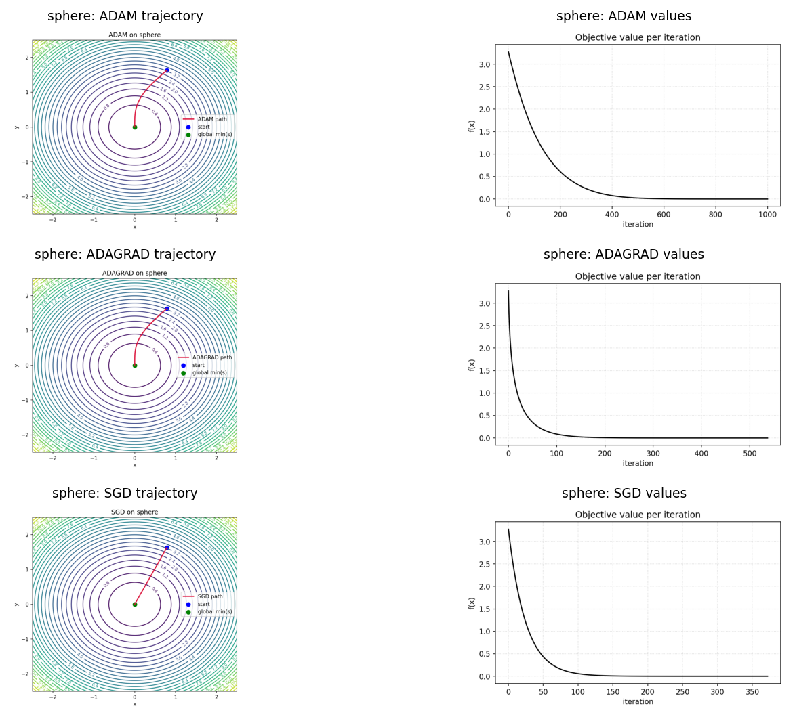

## Kolektif Öğrenme Ödev 1 – Çoklu Objective ve Optimizer Deneyi

Bu repo; birden fazla objective fonksiyonu ve birden fazla optimizasyon algoritmasını sistematik şekilde çalıştırıp sonuçları kaydetmek ve görselleştirmek için hazırlanan modüler bir iskelet sağlar.

### Başlıca Özellikler
- Çoklu objective: `rosenbrock`, `himmelblau` (çoklu lokal minimum), `rastrigin` (çok sayıda lokal minimum), `sphere`.
- Çoklu optimizer: `adam`, `adamv1`, `adamv2`, `sgd` (momentum), `adagrad`.
- Tekil deney koşum arayüzü ve toplu orkestrasyon: farklı objective/optimizer kombinasyonlarını sırayla çalıştırır, sonuçları ayrık klasörlere yazar, çizimleri üretir ve tek bir grid görseline birleştirir.

---

## Kurulum

```bash
python -m venv .venv
source .venv/bin/activate
pip install -r requirements.txt
```

---

## Dizin Yapısı

- `optim/`: `adam.py`, `adam_variant1.py`, `adam_variant2.py`, `sgd.py`, `adagrad.py`
- `objectives/`: `rosenbrock.py`, `himmelblau.py`, `rastrigin.py`, `sphere.py`, `registry.py`
- `experiment/`: `run_opt.py` (tek deney), `main.py` (çoklu koşum orkestratörü)
- `plotting/`: `plot_results.py` (çizim), `plot_cli.py` (CLI ile çizim)
- `outputs/`: deney çıktıları ve görseller
- `comp/`: her objective için tüm algoritma görsellerinin tek grid kompoziti

---

## Tek Deney (Seçili Optimizer + Objective)

```bash
# optimizer: adam | adamv1 | adamv2 | sgd | adagrad
# objective: rosenbrock | himmelblau | rastrigin | sphere
python -m experiment.run_opt \
  --algo adam \
  --objective himmelblau \
  --start -1.5 2.0 \
  --lr 0.005 \
  --iters 2000 \
  --outdir outputs/himmelblau/adam
```

Kaydedilenler: `trajectory.npy`, `values.npy`, `config.json`

Not: `sgd` için `--momentum` parametresi mevcuttur.

---

## Toplu Orkestrasyon (Çoklu Objective ve Optimizer)

```bash
python -m experiment.main \
  --objectives himmelblau rastrigin rosenbrock \
  --algos adam sgd adagrad \
  --iters 2000 \
  --outroot outputs
```

Davranış:
- Her objective için zaman damgalı bir koşu yapılır (tekrar çalıştırmaya uygun).
- Çıktılar `outputs/<objective>/<algo>/` altında toplanır.
- Her kombinasyon için `trajectory.png` ve `values.png` üretilir (dosya adları objective önekli).
- Her objective için tüm algoritmaların görselleri `comp/<timestamp>/<objective>.png` olarak birleştirilir.

Rastgele başlangıç noktası:

```bash
# Objective bounds içinden uniform örnekleme ve tekrarlanabilirlik için tohum
python -m experiment.main \
  --objectives himmelblau rastrigin \
  --algos adam adagrad \
  --random-start \
  --seed 42
```

Notlar:
- `--random-start` aktifken, başlangıç noktası her objective için registry’de tanımlı sınırlar içerisinden seçilir.
- `--seed` verilirse, rastgele seçim tekrarlanabilir olur.

Tüm objective ve tüm optimizer’larla tam koşu örneği:

```bash
python -m experiment.main \
  --objectives rosenbrock himmelblau sphere \
  --algos adam adamv1 adamv2 sgd adagrad \
  --iters 1000 \
  --outroot outputs \
  --random-start \
  --seed 42
```

---

## Çizim (Kayıtlı Dosyalardan)

```bash
# --algo verilmezse, config.json içindeki "algo" başlığa yansıtılır
python -m plotting.plot_cli \
  --indir outputs/himmelblau/adam \
  --traj trajectory.npy \
  --vals values.npy \
  --traj-out trajectory.png \
  --vals-out values.png
```
---

## Örnek Çıktılar

Aşağıdaki görseller daha önce alınmış bir koşunun örnek kompozitleridir. Kendi koşunuzda çıktılar `comp/<timestamp>/<objective>.png` altında oluşur; bu örnekler kolay erişim için `comp/example/` altına kopyalanmıştır.

Örnekleri üreten komut:

```bash
python -m experiment.main \
  --objectives himmelblau rosenbrock sphere \
  --algos adam sgd adagrad \
  --iters 1000 \
  --outroot outputs \
  --random-start \
  --seed 42
```

Himmelblau:



Rosenbrock:



Sphere:



---

## Sayısal Kararlılık
- Koşucu gradyan normunu klipler, `x`/`f(x)` non-finite olduğunda erken durur.
- Kontur üretiminde non-finite değerler maske ile gizlenir.

---

## Notlar
- `himmelblau` ve `rastrigin` birden çok lokal minimum içerir; farklı optimizatörlerin davranışlarını karşılaştırmak için uygundur.
- `adamv1` ve `adamv2` başlangıçta Adam ile aynıdır; kendi algoritmik değişikliklerinizi bu sınıflarda deneyebilirsiniz.

